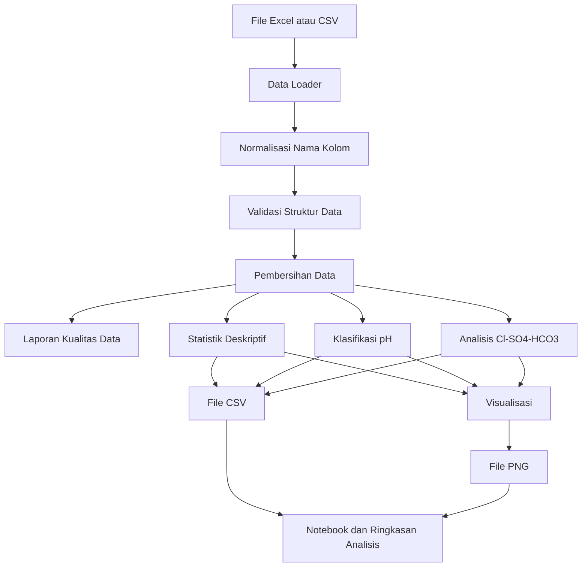

# System Design

## Analisis dan Visualisasi Kimia Air Panas Bumi Menggunakan Python

## 1. Informasi Proyek

* **Nama proyek:** Analisis dan Visualisasi Kimia Air Panas Bumi
* **Jenis proyek:** Analisis data geokimia
* **Platform:** Python dan Jupyter Notebook
* **Sumber data utama:** `Kimia Air_Tugas 1.xlsx`
* **Jumlah sampel awal:** 10 sampel
* **Output utama:** Notebook analisis, dataset bersih, tabel statistik, grafik, dan interpretasi awal
* **Status proyek:** Proyek akademik untuk pembelajaran geokomputasi dan geokimia panas bumi

---

## 2. Latar Belakang

Data kimia air panas bumi dapat digunakan untuk membantu mengenali karakteristik fluida geotermal. Beberapa parameter penting yang dianalisis meliputi suhu, pH, TDS, serta kandungan ion seperti Cl, SO₄, HCO₃, Na, K, Ca, Mg, dan SiO₂.

Data awal tersedia dalam bentuk file Excel. Analisis secara manual menggunakan tabel memiliki beberapa keterbatasan, seperti:

* sulit melihat pola antar-sampel;
* rawan kesalahan pembacaan;
* sulit mengulang proses analisis secara konsisten;
* kurang efektif untuk membandingkan banyak parameter;
* sulit mendokumentasikan aturan pembersihan data.

Python digunakan untuk membuat proses pengolahan data menjadi lebih terstruktur, konsisten, dapat diulang, dan mudah diperiksa kembali.

---

## 3. Tujuan Sistem

Sistem ini dibuat untuk:

1. Membaca data kimia air panas bumi dari file Excel atau CSV.
2. Memeriksa struktur dan kualitas data.
3. Membersihkan nilai yang kosong atau tidak standar.
4. Menghasilkan statistik deskriptif setiap parameter.
5. Mengelompokkan karakter pH sampel.
6. Membandingkan kandungan Cl, SO₄, dan HCO₃.
7. Memberikan klasifikasi awal kecenderungan tipe fluida.
8. Membuat visualisasi data yang mudah dipahami.
9. Menyimpan hasil pengolahan ke file CSV dan PNG.
10. Menyediakan notebook yang menjelaskan seluruh proses analisis.

---

## 4. Ruang Lingkup

### 4.1 Termasuk dalam ruang lingkup

Sistem mencakup:

* pembacaan file Excel dan CSV;
* pemilihan sheet Excel;
* normalisasi nama kolom;
* pemeriksaan kolom wajib;
* pembersihan nilai kosong;
* penanganan simbol `-`;
* penanganan nilai batas deteksi seperti `<1` dan `<5`;
* pemeriksaan nilai negatif;
* konversi kolom numerik;
* statistik deskriptif;
* klasifikasi pH;
* analisis dominasi Cl, SO₄, dan HCO₃;
* visualisasi data;
* penyimpanan dataset bersih;
* penyimpanan laporan kualitas data;
* penyimpanan hasil klasifikasi;
* penyimpanan grafik;
* dokumentasi melalui Jupyter Notebook.

### 4.2 Tidak termasuk dalam ruang lingkup

Sistem tidak mencakup:

* pengambilan sampel lapangan;
* analisis laboratorium;
* aplikasi web atau aplikasi mobile;
* penyimpanan menggunakan database;
* autentikasi pengguna;
* machine learning;
* klasifikasi tipe fluida menggunakan AI;
* prediksi reservoir;
* perhitungan geotermometer lanjutan;
* kesimpulan geologi definitif;
* deployment ke server.

Klasifikasi fluida yang dihasilkan hanya merupakan interpretasi awal berdasarkan pola data yang tersedia.

---

## 5. Prinsip Implementasi

Implementasi harus mengikuti prinsip berikut:

1. File data mentah tidak boleh dimodifikasi.
2. Semua perubahan data harus dilakukan pada salinan atau DataFrame.
3. Aturan pembersihan data harus dapat ditelusuri.
4. Nilai asli harus tetap tersedia untuk pemeriksaan.
5. Path file tidak boleh ditulis secara absolut.
6. Fungsi analisis tidak boleh bergantung langsung pada notebook.
7. Notebook hanya memanggil fungsi dari folder `src`.
8. Hasil pengolahan harus dapat direproduksi.
9. Sistem tidak boleh mengarang nilai yang tidak tersedia.
10. Interpretasi harus menggunakan istilah seperti “cenderung” atau “indikasi awal”, bukan kesimpulan mutlak.

---

## 6. Teknologi yang Digunakan

### 6.1 Bahasa pemrograman

* Python 3.10 atau lebih baru

### 6.2 Library utama

* `pandas` untuk membaca dan mengolah data
* `numpy` untuk operasi numerik
* `matplotlib` untuk visualisasi
* `openpyxl` untuk membaca file Excel
* `jupyter` untuk notebook analisis
* `pytest` untuk pengujian fungsi
* `pyyaml` untuk membaca konfigurasi YAML

### 6.3 Library opsional

* `scipy` untuk analisis statistik tambahan
* `plotly` apabila dibutuhkan untuk visualisasi interaktif

Versi pertama sistem tidak boleh bergantung pada library opsional.

---

## 7. Struktur Direktori

```text
geothermal-water-analysis/
├── data/
│   ├── raw/
│   │   └── Kimia Air_Tugas 1.xlsx
│   ├── interim/
│   │   └── normalized_data.csv
│   └── processed/
│       ├── cleaned_water_chemistry.csv
│       ├── water_chemistry_statistics.csv
│       ├── fluid_classification.csv
│       └── data_quality_report.csv
│
├── notebooks/
│   └── geothermal_water_analysis.ipynb
│
├── outputs/
│   ├── figures/
│   │   ├── ph_by_sample.png
│   │   ├── tds_by_sample.png
│   │   ├── temperature_by_sample.png
│   │   ├── major_ion_comparison.png
│   │   ├── major_ion_normalized.png
│   │   ├── temperature_vs_sio2.png
│   │   └── tds_vs_chloride.png
│   └── reports/
│       └── analysis_summary.md
│
├── src/
│   ├── __init__.py
│   ├── config.py
│   ├── data_loader.py
│   ├── data_cleaner.py
│   ├── data_validator.py
│   ├── statistics.py
│   ├── classification.py
│   ├── visualization.py
│   └── pipeline.py
│
├── tests/
│   ├── __init__.py
│   ├── test_data_cleaner.py
│   ├── test_data_validator.py
│   └── test_classification.py
│
├── config/
│   └── analysis_config.yaml
│
├── .gitignore
├── requirements.txt
├── README.md
└── system-design.md
```

---

## 8. Arsitektur Sistem

Sistem menggunakan arsitektur pipeline analisis data sederhana.



---

## 9. Deskripsi Modul

### 9.1 `config.py`

Bertanggung jawab untuk:

* membaca konfigurasi dari YAML;
* menyimpan path input dan output;
* menyimpan daftar kolom wajib;
* menyimpan aturan klasifikasi pH;
* menyimpan aturan batas deteksi;
* membuat direktori output apabila belum tersedia.

Modul ini tidak boleh berisi logika analisis.

---

### 9.2 `data_loader.py`

Bertanggung jawab untuk:

* membaca file `.xlsx`;
* membaca file `.csv`;
* memilih sheet Excel;
* menampilkan daftar sheet jika diperlukan;
* mendeteksi format file;
* mengembalikan data dalam bentuk `pandas.DataFrame`;
* memberikan error yang jelas jika file tidak ditemukan atau format tidak didukung.

Contoh fungsi:

```python
def load_dataset(
    file_path: str,
    sheet_name: str | int | None = None
) -> pd.DataFrame:
    ...
```

---

### 9.3 `data_validator.py`

Bertanggung jawab untuk:

* memeriksa apakah DataFrame kosong;
* memeriksa keberadaan kolom wajib;
* memeriksa ID sampel yang kosong;
* memeriksa ID sampel yang duplikat;
* memeriksa kolom yang tidak dikenali;
* memeriksa tipe data;
* memeriksa nilai negatif pada kolom konsentrasi;
* menghasilkan daftar peringatan dan kesalahan.

Validasi tidak boleh langsung menghapus data.

Contoh hasil validasi:

```python
{
    "is_valid": True,
    "errors": [],
    "warnings": [
        "Ditemukan 2 nilai di bawah batas deteksi",
        "Ditemukan 1 nilai negatif pada kolom Mg"
    ]
}
```

---

### 9.4 `data_cleaner.py`

Bertanggung jawab untuk:

* menormalisasi nama kolom;
* menghapus spasi berlebih;
* mengubah simbol data kosong menjadi `NaN`;
* menangani nilai batas deteksi;
* mengubah kolom numerik;
* menandai nilai tidak valid;
* membuat laporan perubahan data.

Contoh fungsi:

```python
def normalize_column_names(df: pd.DataFrame) -> pd.DataFrame:
    ...

def clean_numeric_value(
    value,
    detection_limit_strategy: str = "half"
) -> float | None:
    ...

def clean_dataset(
    df: pd.DataFrame,
    config: dict
) -> tuple[pd.DataFrame, pd.DataFrame]:
    ...
```

Return value `clean_dataset`:

1. DataFrame yang telah dibersihkan.
2. DataFrame laporan kualitas dan perubahan data.

---

### 9.5 `statistics.py`

Bertanggung jawab untuk menghitung:

* jumlah data;
* jumlah nilai kosong;
* rata-rata;
* median;
* standar deviasi;
* nilai minimum;
* nilai maksimum;
* kuartil pertama;
* kuartil ketiga.

Contoh fungsi:

```python
def calculate_summary_statistics(
    df: pd.DataFrame,
    columns: list[str]
) -> pd.DataFrame:
    ...
```

---

### 9.6 `classification.py`

Bertanggung jawab untuk:

* klasifikasi pH;
* normalisasi Cl, SO₄, dan HCO₃;
* menentukan ion dominan;
* memberikan label kecenderungan tipe fluida;
* memberikan status data tidak cukup;
* memberikan status campuran jika dominasi tidak jelas.

Contoh fungsi:

```python
def classify_ph(
    ph: float,
    acidic_max: float,
    neutral_max: float
) -> str:
    ...

def calculate_major_ion_proportions(
    chloride: float,
    sulfate: float,
    bicarbonate: float
) -> dict:
    ...

def classify_fluid_tendency(
    chloride: float,
    sulfate: float,
    bicarbonate: float,
    mixed_threshold: float
) -> str:
    ...
```

---

### 9.7 `visualization.py`

Bertanggung jawab untuk:

* membuat grafik;
* memberikan judul dan label sumbu;
* menyimpan grafik sebagai PNG;
* menutup figure setelah disimpan;
* menangani data kosong;
* menggunakan resolusi minimal 300 DPI.

Contoh fungsi:

```python
def plot_parameter_by_sample(
    df: pd.DataFrame,
    parameter: str,
    output_path: str
) -> None:
    ...

def plot_scatter_with_labels(
    df: pd.DataFrame,
    x_column: str,
    y_column: str,
    label_column: str,
    output_path: str
) -> None:
    ...

def plot_normalized_major_ions(
    df: pd.DataFrame,
    output_path: str
) -> None:
    ...
```

---

### 9.8 `pipeline.py`

Menjadi entry point utama sistem.

Pipeline harus menjalankan:

1. membaca konfigurasi;
2. membaca dataset;
3. menormalisasi nama kolom;
4. memvalidasi dataset;
5. membersihkan dataset;
6. menyimpan dataset bersih;
7. menghitung statistik;
8. melakukan klasifikasi;
9. membuat visualisasi;
10. menyimpan seluruh hasil;
11. menampilkan ringkasan proses.

Contoh eksekusi:

```bash
python -m src.pipeline
```

Contoh eksekusi dengan input:

```bash
python -m src.pipeline \
  --input "data/raw/Kimia Air_Tugas 1.xlsx" \
  --sheet-name "Sheet1"
```

---

## 10. Struktur Data

### 10.1 Kolom utama

Dataset diperkirakan memiliki kolom berikut:

| Nama kolom standar | Deskripsi              | Tipe data |
| ------------------ | ---------------------- | --------- |
| `sample_id`        | ID unik sampel         | string    |
| `sample_name`      | Nama sampel            | string    |
| `temperature`      | Suhu sampel            | float     |
| `ph`               | Derajat keasaman       | float     |
| `tds`              | Total dissolved solids | float     |
| `li`               | Konsentrasi litium     | float     |
| `na`               | Konsentrasi natrium    | float     |
| `k`                | Konsentrasi kalium     | float     |
| `ca`               | Konsentrasi kalsium    | float     |
| `mg`               | Konsentrasi magnesium  | float     |
| `sio2`             | Konsentrasi silika     | float     |
| `b`                | Konsentrasi boron      | float     |
| `cl`               | Konsentrasi klorida    | float     |
| `so4`              | Konsentrasi sulfat     | float     |
| `hco3`             | Konsentrasi bikarbonat | float     |

AI Agent harus memeriksa nama kolom yang sebenarnya pada file Excel sebelum memproses data.

Jangan mengasumsikan bahwa seluruh nama kolom sudah sama dengan tabel di atas.

---

### 10.2 Alias nama kolom

Sistem harus mendukung alias umum berikut:

```python
COLUMN_ALIASES = {
    "id": "sample_id",
    "sample id": "sample_id",
    "sample_id": "sample_id",
    "nama sampel": "sample_name",
    "sample name": "sample_name",
    "sample": "sample_name",
    "temp": "temperature",
    "temperature": "temperature",
    "temperatur": "temperature",
    "suhu": "temperature",
    "ph": "ph",
    "tds": "tds",
    "li": "li",
    "na": "na",
    "k": "k",
    "ca": "ca",
    "mg": "mg",
    "sio2": "sio2",
    "sio₂": "sio2",
    "silica": "sio2",
    "b": "b",
    "cl": "cl",
    "chloride": "cl",
    "klorida": "cl",
    "so4": "so4",
    "so₄": "so4",
    "sulfate": "so4",
    "sulfat": "so4",
    "hco3": "hco3",
    "hco₃": "hco3",
    "bicarbonate": "hco3",
    "bikarbonat": "hco3"
}
```

Normalisasi nama kolom harus:

1. mengubah huruf menjadi lowercase;
2. menghapus spasi awal dan akhir;
3. mengganti spasi dengan underscore bila diperlukan;
4. menyesuaikan nama menggunakan alias;
5. mempertahankan daftar nama kolom asli untuk dokumentasi.

---

## 11. Aturan Pembersihan Data

### 11.1 Data mentah

File dalam direktori `data/raw` bersifat immutable.

Sistem dilarang:

* mengubah file asli;
* menimpa file asli;
* menyimpan hasil pembersihan di direktori `data/raw`.

---

### 11.2 Nilai kosong

Nilai berikut dianggap kosong:

```text
""
"-"
"—"
"NA"
"N/A"
"null"
"None"
```

Nilai tersebut diubah menjadi:

```python
numpy.nan
```

---

### 11.3 Nilai batas deteksi

Nilai seperti:

```text
<1
<5
<0.1
```

berarti nilai berada di bawah batas deteksi.

Strategi default:

```text
half_detection_limit
```

Contoh:

```text
<1   menjadi 0.5
<5   menjadi 2.5
<0.1 menjadi 0.05
```

Nilai hasil konversi harus diberi flag bahwa nilai tersebut berasal dari batas deteksi.

Contoh kolom tambahan:

```text
cl_below_detection_limit
so4_below_detection_limit
hco3_below_detection_limit
```

Strategi harus dapat diubah melalui konfigurasi menjadi:

* `half`: setengah dari batas deteksi;
* `zero`: menjadi nol;
* `limit`: menggunakan nilai batas;
* `nan`: dianggap tidak tersedia.

Strategi default adalah `half`.

---

### 11.4 Nilai negatif

Nilai negatif dianggap tidak valid untuk kolom konsentrasi berikut:

```text
tds
li
na
k
ca
mg
sio2
b
cl
so4
hco3
```

Aturan:

1. simpan informasi nilai asli di laporan kualitas data;
2. ubah nilai negatif menjadi `NaN`;
3. tambahkan status `invalid_negative_value`;
4. jangan mengganti nilai negatif menjadi nol secara diam-diam.

Untuk kolom pH dan suhu, nilai tidak langsung dihapus. Sistem harus memberikan peringatan dan meminta pemeriksaan karena penanganannya bergantung pada konteks dataset.

---

### 11.5 Data duplikat

Jika `sample_id` duplikat:

* jangan langsung menghapus salah satu baris;
* masukkan duplikasi ke laporan validasi;
* hentikan pipeline apabila isi baris berbeda;
* jika seluruh isi baris sama, duplikasi boleh dihapus dengan mencatat perubahan.

---

### 11.6 Konversi numerik

Kolom kimia harus dikonversi menjadi numerik menggunakan:

```python
pd.to_numeric(errors="coerce")
```

Nilai yang gagal dikonversi harus dicatat dalam laporan kualitas data.

---

## 12. Klasifikasi pH

Klasifikasi pH default:

| Kondisi         | Aturan                     |
| --------------- | -------------------------- |
| Asam            | pH < 6.5                   |
| Netral          | 6.5 ≤ pH ≤ 7.5             |
| Alkali          | pH > 7.5                   |
| Tidak diketahui | pH kosong atau tidak valid |

Nilai batas harus disimpan dalam file konfigurasi agar dapat disesuaikan dengan arahan dosen atau dasar teori yang digunakan.

Contoh hasil:

| sample_id |  ph | ph_category |
| --------- | --: | ----------- |
| S01       | 4.2 | Asam        |
| S02       | 7.0 | Netral      |
| S03       | 8.4 | Alkali      |

Klasifikasi ini hanya menggambarkan kondisi pH, bukan tipe fluida secara keseluruhan.

---

## 13. Analisis Cl–SO₄–HCO₃

### 13.1 Tujuan

Analisis digunakan untuk mengetahui proporsi relatif tiga ion utama:

* Cl atau klorida;
* SO₄ atau sulfat;
* HCO₃ atau bikarbonat.

### 13.2 Normalisasi

Untuk setiap sampel:

```text
total_ion = Cl + SO4 + HCO3
```

Kemudian:

```text
Cl (%)   = Cl / total_ion × 100
SO4 (%)  = SO4 / total_ion × 100
HCO3 (%) = HCO3 / total_ion × 100
```

Jumlah hasil normalisasi harus mendekati 100%.

Jika seluruh nilai bernilai nol atau kosong, klasifikasi menjadi:

```text
Data tidak cukup
```

---

### 13.3 Aturan dominasi

Ion dengan persentase terbesar dianggap sebagai ion dominan.

Klasifikasi awal:

| Ion dominan | Kecenderungan fluida    |
| ----------- | ----------------------- |
| Cl          | Klorida                 |
| SO₄         | Sulfat atau asam-sulfat |
| HCO₃        | Bikarbonat              |

Untuk label asam-sulfat, sistem harus mempertimbangkan pH.

Aturan:

```text
Jika SO4 dominan dan pH < batas asam:
    label = "Cenderung asam-sulfat"

Jika SO4 dominan tetapi pH tidak asam:
    label = "Cenderung sulfat"

Jika Cl dominan:
    label = "Cenderung klorida"

Jika HCO3 dominan:
    label = "Cenderung bikarbonat"
```

---

### 13.4 Fluida campuran

Jika selisih antara ion dominan pertama dan kedua kurang dari nilai `mixed_threshold`, sampel dikategorikan campuran.

Nilai default:

```text
mixed_threshold = 10 percentage points
```

Contoh:

```text
Cl   = 42%
SO4  = 38%
HCO3 = 20%
```

Selisih Cl dan SO₄ hanya 4%, sehingga label:

```text
Campuran klorida-sulfat
```

Urutan nama campuran mengikuti dua persentase terbesar.

---

### 13.5 Batasan interpretasi

Klasifikasi ini merupakan pendekatan sederhana.

Sistem harus mencantumkan bahwa:

* hasil bukan klasifikasi geologi definitif;
* konsentrasi ion harus memiliki satuan yang konsisten;
* hasil dipengaruhi kualitas data;
* pencampuran fluida tidak selalu dapat dijelaskan hanya oleh tiga ion;
* lokasi dan kondisi pengambilan sampel belum dianalisis;
* interpretasi akhir tetap memerlukan teori geokimia dan penilaian manusia.

---

## 14. Analisis Statistik

Statistik dihitung untuk parameter:

```text
temperature
ph
tds
li
na
k
ca
mg
sio2
b
cl
so4
hco3
```

Output statistik minimal:

| Statistik | Penjelasan         |
| --------- | ------------------ |
| `count`   | Jumlah data valid  |
| `missing` | Jumlah data kosong |
| `mean`    | Rata-rata          |
| `median`  | Nilai tengah       |
| `std`     | Standar deviasi    |
| `min`     | Nilai minimum      |
| `q1`      | Kuartil pertama    |
| `q3`      | Kuartil ketiga     |
| `max`     | Nilai maksimum     |

Output disimpan ke:

```text
data/processed/water_chemistry_statistics.csv
```

---

## 15. Visualisasi

### 15.1 Grafik pH per sampel

Jenis:

```text
Bar chart
```

Isi:

* sumbu X: nama atau ID sampel;
* sumbu Y: nilai pH;
* garis referensi batas asam dan netral;
* label nilai pH pada setiap batang.

Output:

```text
outputs/figures/ph_by_sample.png
```

---

### 15.2 Grafik TDS per sampel

Jenis:

```text
Bar chart
```

Isi:

* sumbu X: nama atau ID sampel;
* sumbu Y: TDS;
* satuan harus mengikuti dataset;
* urutan sampel mengikuti data asli atau konfigurasi.

Output:

```text
outputs/figures/tds_by_sample.png
```

---

### 15.3 Grafik suhu per sampel

Jenis:

```text
Bar chart
```

Output:

```text
outputs/figures/temperature_by_sample.png
```

---

### 15.4 Perbandingan ion utama

Jenis:

```text
Grouped bar chart
```

Parameter:

* Cl;
* SO₄;
* HCO₃.

Output:

```text
outputs/figures/major_ion_comparison.png
```

Grafik ini menggunakan konsentrasi asli.

---

### 15.5 Proporsi ion utama

Jenis:

```text
100% stacked bar chart
```

Parameter:

* persentase Cl;
* persentase SO₄;
* persentase HCO₃.

Output:

```text
outputs/figures/major_ion_normalized.png
```

Grafik ini digunakan untuk melihat kecenderungan tipe fluida secara lebih mudah.

---

### 15.6 Hubungan suhu dan SiO₂

Jenis:

```text
Scatter plot
```

Isi:

* sumbu X: suhu;
* sumbu Y: SiO₂;
* setiap titik diberi label ID sampel;
* tidak boleh langsung menyimpulkan hubungan sebab-akibat.

Output:

```text
outputs/figures/temperature_vs_sio2.png
```

---

### 15.7 Hubungan TDS dan Cl

Jenis:

```text
Scatter plot
```

Isi:

* sumbu X: TDS;
* sumbu Y: Cl;
* setiap titik diberi label ID sampel.

Output:

```text
outputs/figures/tds_vs_chloride.png
```

---

### 15.8 Ketentuan visualisasi

Semua visualisasi harus:

* memiliki judul;
* memiliki label sumbu;
* mencantumkan satuan jika tersedia;
* memiliki ukuran yang mudah dibaca;
* tidak menutupi label sampel;
* disimpan minimal 300 DPI;
* menggunakan `tight_layout()`;
* ditutup menggunakan `plt.close()`;
* tetap dapat dibuat ketika sebagian data kosong;
* tidak menggunakan warna untuk menyampaikan satu-satunya informasi penting.

---

## 16. File Konfigurasi

Contoh `config/analysis_config.yaml`:

```yaml
project:
  name: "Analisis dan Visualisasi Kimia Air Panas Bumi"

input:
  file_path: "data/raw/Kimia Air_Tugas 1.xlsx"
  sheet_name: null

output:
  processed_directory: "data/processed"
  figures_directory: "outputs/figures"
  reports_directory: "outputs/reports"

cleaning:
  missing_markers:
    - ""
    - "-"
    - "—"
    - "NA"
    - "N/A"
    - "null"
    - "None"

  detection_limit_strategy: "half"
  remove_exact_duplicates: true
  convert_negative_concentration_to_nan: true

ph_classification:
  acidic_max: 6.5
  neutral_max: 7.5

fluid_classification:
  mixed_threshold: 10.0
  minimum_valid_ions: 2

visualization:
  dpi: 300
  figure_width: 10
  figure_height: 6
  show_sample_labels: true
```

---

## 17. Output Sistem

Setelah pipeline selesai, sistem harus menghasilkan:

### 17.1 Dataset bersih

```text
data/processed/cleaned_water_chemistry.csv
```

Berisi:

* nilai hasil pembersihan;
* kategori pH;
* persentase Cl;
* persentase SO₄;
* persentase HCO₃;
* ion dominan;
* klasifikasi kecenderungan fluida.

---

### 17.2 Laporan kualitas data

```text
data/processed/data_quality_report.csv
```

Kolom minimal:

| Kolom            | Deskripsi                 |
| ---------------- | ------------------------- |
| `row_index`      | Posisi baris              |
| `sample_id`      | ID sampel                 |
| `column_name`    | Nama kolom                |
| `original_value` | Nilai sebelum dibersihkan |
| `cleaned_value`  | Nilai setelah dibersihkan |
| `issue_type`     | Jenis masalah             |
| `action`         | Tindakan yang dilakukan   |

Contoh `issue_type`:

```text
missing_value
below_detection_limit
invalid_negative_value
numeric_conversion_failed
duplicate_sample_id
```

---

### 17.3 Statistik

```text
data/processed/water_chemistry_statistics.csv
```

---

### 17.4 Hasil klasifikasi

```text
data/processed/fluid_classification.csv
```

Kolom minimal:

```text
sample_id
sample_name
ph
ph_category
cl
so4
hco3
cl_percentage
so4_percentage
hco3_percentage
dominant_ion
fluid_tendency
classification_note
```

---

### 17.5 Grafik

Semua grafik disimpan di:

```text
outputs/figures/
```

---

### 17.6 Ringkasan analisis

```text
outputs/reports/analysis_summary.md
```

Ringkasan minimal mencakup:

* jumlah sampel;
* jumlah data bermasalah;
* rentang suhu;
* rentang pH;
* sampel dengan TDS tertinggi;
* sampel dengan Cl tertinggi;
* sampel dengan SO₄ tertinggi;
* sampel dengan HCO₃ tertinggi;
* jumlah sampel berdasarkan kategori pH;
* jumlah sampel berdasarkan kecenderungan fluida;
* batasan interpretasi.

Ringkasan harus dibuat berdasarkan hasil perhitungan, bukan teks yang ditulis secara statis.

---

## 18. Desain Notebook

File:

```text
notebooks/geothermal_water_analysis.ipynb
```

Notebook harus memiliki bagian berikut.

### 18.1 Judul dan identitas proyek

Berisi:

* judul proyek;
* nama kelompok;
* tujuan analisis;
* sumber data;
* batasan dataset.

### 18.2 Import library

Notebook hanya mengimpor library dan fungsi dari `src`.

Logika utama tidak boleh ditulis ulang di banyak cell.

### 18.3 Memuat konfigurasi

Tampilkan:

* path input;
* sheet yang dipakai;
* strategi batas deteksi;
* batas klasifikasi pH.

### 18.4 Membaca data mentah

Tampilkan:

* lima baris pertama;
* bentuk dataset;
* daftar kolom;
* tipe data awal.

### 18.5 Pemeriksaan kualitas data

Tampilkan:

* nilai kosong;
* simbol tidak standar;
* nilai batas deteksi;
* nilai negatif;
* duplikasi.

### 18.6 Pembersihan data

Jelaskan setiap aturan pembersihan yang diterapkan.

### 18.7 Statistik deskriptif

Tampilkan tabel statistik.

### 18.8 Klasifikasi pH

Tampilkan hasil kategori pH setiap sampel.

### 18.9 Analisis ion utama

Tampilkan:

* konsentrasi Cl, SO₄, dan HCO₃;
* proporsi relatif;
* ion dominan;
* kecenderungan tipe fluida.

### 18.10 Visualisasi

Tampilkan seluruh grafik yang relevan.

### 18.11 Interpretasi

Interpretasi harus:

* berdasarkan data;
* menyebutkan sampel secara jelas;
* tidak melebih-lebihkan hasil;
* menggunakan istilah “cenderung”, “menunjukkan indikasi”, atau “berdasarkan data yang tersedia”;
* menjelaskan keterbatasan dataset.

### 18.12 Kesimpulan

Berisi:

* keberhasilan pipeline;
* temuan umum;
* keterbatasan;
* kemungkinan pengembangan.

---

## 19. Error Handling

Sistem harus memberikan pesan error yang jelas.

### 19.1 File tidak ditemukan

```text
File input tidak ditemukan: data/raw/Kimia Air_Tugas 1.xlsx
Pastikan file telah ditempatkan di direktori data/raw.
```

### 19.2 Sheet tidak ditemukan

```text
Sheet yang diminta tidak ditemukan.
Sheet yang tersedia: Sheet1, Data, Summary.
```

### 19.3 Kolom wajib tidak tersedia

```text
Kolom wajib tidak ditemukan: cl, so4, hco3.
Periksa nama kolom atau tambahkan alias pada konfigurasi.
```

### 19.4 Data kosong

```text
Dataset tidak memiliki baris data yang dapat dianalisis.
```

### 19.5 Seluruh ion kosong

```text
Sampel S01 tidak dapat diklasifikasikan karena data Cl, SO4, dan HCO3 tidak mencukupi.
```

Sistem tidak boleh gagal tanpa pesan penjelasan.

---

## 20. Logging

Pipeline harus mencatat proses utama menggunakan modul `logging`.

Level yang digunakan:

* `INFO` untuk tahapan normal;
* `WARNING` untuk masalah data yang masih dapat diproses;
* `ERROR` untuk masalah yang menghentikan pipeline.

Contoh:

```text
INFO - Membaca file data/raw/Kimia Air_Tugas 1.xlsx
INFO - Dataset berhasil dibaca: 10 baris, 15 kolom
WARNING - Ditemukan 3 nilai di bawah batas deteksi
WARNING - Ditemukan 1 nilai negatif pada kolom Mg
INFO - Dataset bersih berhasil disimpan
INFO - 7 visualisasi berhasil dibuat
INFO - Pipeline selesai
```

---

## 21. Pengujian

### 21.1 Unit test pembersihan data

Pengujian minimal:

```python
def test_dash_becomes_nan():
    ...

def test_less_than_one_becomes_half():
    ...

def test_less_than_five_becomes_half():
    ...

def test_negative_concentration_becomes_nan():
    ...

def test_numeric_string_becomes_float():
    ...

def test_invalid_text_becomes_nan():
    ...
```

### 21.2 Unit test klasifikasi pH

```python
def test_acidic_ph():
    ...

def test_neutral_ph():
    ...

def test_alkaline_ph():
    ...

def test_missing_ph():
    ...
```

### 21.3 Unit test klasifikasi fluida

```python
def test_chloride_dominant():
    ...

def test_sulfate_dominant_acidic():
    ...

def test_sulfate_dominant_non_acidic():
    ...

def test_bicarbonate_dominant():
    ...

def test_mixed_fluid():
    ...

def test_insufficient_ion_data():
    ...

def test_normalized_ions_sum_to_100():
    ...
```

### 21.4 Integration test

Integration test harus memastikan bahwa pipeline:

1. dapat membaca dataset contoh;
2. menghasilkan dataset bersih;
3. menghasilkan tabel statistik;
4. menghasilkan file klasifikasi;
5. menghasilkan seluruh grafik wajib;
6. tidak mengubah file data mentah.

---

## 22. Kriteria Penerimaan

Proyek dianggap memenuhi kebutuhan apabila:

* [ ] File Excel dapat dibaca.
* [ ] Nama kolom berhasil dinormalisasi.
* [ ] Simbol `-` berhasil ditangani.
* [ ] Nilai `<1` dan `<5` berhasil ditangani.
* [ ] Nilai negatif pada kolom konsentrasi terdeteksi.
* [ ] Semua perubahan data tercatat.
* [ ] Dataset bersih berhasil disimpan sebagai CSV.
* [ ] Statistik deskriptif berhasil dibuat.
* [ ] pH berhasil dikelompokkan.
* [ ] Persentase Cl, SO₄, dan HCO₃ berhasil dihitung.
* [ ] Kecenderungan tipe fluida berhasil diberikan.
* [ ] Sampel campuran dapat dikenali.
* [ ] Sampel dengan data tidak cukup tidak dipaksakan untuk diklasifikasikan.
* [ ] Grafik pH berhasil dibuat.
* [ ] Grafik TDS berhasil dibuat.
* [ ] Grafik ion utama berhasil dibuat.
* [ ] Scatter plot suhu–SiO₂ berhasil dibuat.
* [ ] Scatter plot TDS–Cl berhasil dibuat.
* [ ] Notebook dapat dijalankan dari awal sampai akhir tanpa error.
* [ ] File mentah tidak berubah.
* [ ] Seluruh pengujian berhasil dijalankan.

---

## 23. Urutan Implementasi untuk AI Agent

AI Agent harus mengerjakan proyek secara bertahap.

### Tahap 1: Inspeksi proyek

1. Periksa seluruh file yang tersedia.
2. Periksa nama file Excel.
3. Periksa nama sheet.
4. Periksa header dan posisi tabel.
5. Periksa satuan setiap parameter.
6. Jangan menulis asumsi struktur sebelum file diperiksa.

### Tahap 2: Setup proyek

1. Buat struktur direktori.
2. Buat `requirements.txt`.
3. Buat `.gitignore`.
4. Buat file konfigurasi.
5. Buat modul Python dasar.

### Tahap 3: Data loader dan validator

1. Implementasikan pembacaan Excel dan CSV.
2. Implementasikan normalisasi nama kolom.
3. Implementasikan pemeriksaan kolom.
4. Implementasikan laporan validasi.
5. Tambahkan unit test.

### Tahap 4: Pembersihan data

1. Implementasikan nilai kosong.
2. Implementasikan batas deteksi.
3. Implementasikan nilai negatif.
4. Implementasikan konversi numerik.
5. Implementasikan data quality report.
6. Tambahkan unit test.

### Tahap 5: Analisis

1. Implementasikan statistik deskriptif.
2. Implementasikan klasifikasi pH.
3. Implementasikan normalisasi Cl–SO₄–HCO₃.
4. Implementasikan klasifikasi kecenderungan fluida.
5. Tambahkan unit test.

### Tahap 6: Visualisasi

1. Buat grafik pH.
2. Buat grafik TDS.
3. Buat grafik suhu.
4. Buat perbandingan ion utama.
5. Buat grafik proporsi ion.
6. Buat scatter plot.
7. Simpan seluruh grafik.

### Tahap 7: Notebook

1. Buat notebook utama.
2. Gunakan fungsi dari modul `src`.
3. Tambahkan penjelasan setiap tahap.
4. Tambahkan interpretasi awal.
5. Tambahkan keterbatasan analisis.

### Tahap 8: Finalisasi

1. Jalankan semua test.
2. Jalankan pipeline.
3. Periksa seluruh output.
4. Pastikan file mentah tidak berubah.
5. Perbarui README.
6. Buat ringkasan hasil.

---

## 24. Aturan Khusus untuk AI Agent

AI Agent wajib mengikuti aturan berikut:

1. Baca `system-design.md` sebelum mengubah kode.
2. Periksa file data asli sebelum membuat mapping kolom.
3. Jangan mengarang nama sheet, nama kolom, satuan, atau nilai data.
4. Jangan mengubah data mentah.
5. Jangan menghapus data tanpa mencatat alasannya.
6. Jangan mengganti nilai bermasalah secara diam-diam.
7. Jangan menyimpulkan korelasi sebagai hubungan sebab-akibat.
8. Jangan menyebut klasifikasi sebagai hasil geologi definitif.
9. Jangan membuat aplikasi web atau database.
10. Jangan menambahkan machine learning.
11. Jangan menulis seluruh logika di notebook.
12. Gunakan fungsi kecil dengan satu tanggung jawab.
13. Tambahkan type hint pada fungsi.
14. Tambahkan docstring pada fungsi publik.
15. Gunakan nama variabel berbahasa Inggris yang jelas.
16. Gunakan penjelasan notebook dalam bahasa Indonesia.
17. Jangan menggunakan absolute path.
18. Jangan menambahkan dependency tanpa kebutuhan nyata.
19. Jalankan test setelah mengubah fungsi utama.
20. Laporkan asumsi dan keterbatasan dalam dokumentasi.

Jika struktur file aktual berbeda dengan desain ini, AI Agent harus menyesuaikan implementasi tanpa mengubah tujuan utama proyek.

---

## 25. Requirements

Isi awal `requirements.txt`:

```txt
pandas
numpy
matplotlib
openpyxl
jupyter
pytest
pyyaml
```

Untuk membuat environment:

```bash
python -m venv .venv
```

Aktivasi pada Linux:

```bash
source .venv/bin/activate
```

Aktivasi pada Windows PowerShell:

```powershell
.venv\Scripts\Activate.ps1
```

Instalasi dependency:

```bash
pip install -r requirements.txt
```

Menjalankan test:

```bash
pytest
```

Menjalankan pipeline:

```bash
python -m src.pipeline
```

Menjalankan notebook:

```bash
jupyter notebook
```

---

## 26. Definisi Selesai

Proyek dinyatakan selesai ketika:

1. struktur proyek sudah sesuai;
2. dataset dapat dibaca;
3. pembersihan data dapat dijalankan;
4. laporan kualitas data tersedia;
5. statistik tersedia;
6. klasifikasi pH tersedia;
7. analisis Cl–SO₄–HCO₃ tersedia;
8. grafik tersedia;
9. notebook dapat dijalankan dari awal sampai akhir;
10. test berhasil;
11. dokumentasi menjelaskan cara menjalankan proyek;
12. interpretasi hasil tidak melampaui data yang tersedia.
